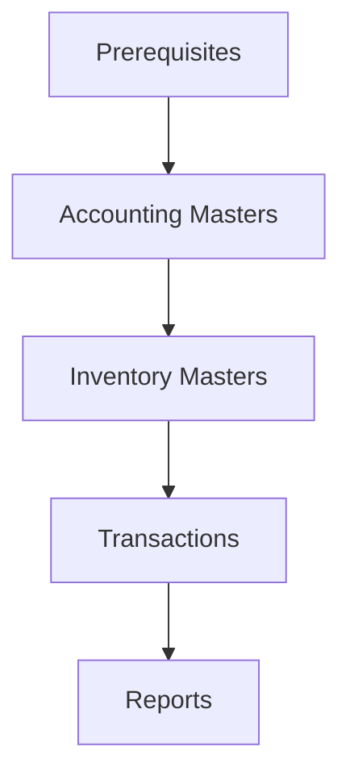

# TallyPrime API Workflow

This API follows a sequential workflow where each step depends on the previous one. Below is the logical flow to integrate with TallyPrime:

## Workflow Overview

```plaintext
[Prerequisites] → [Accounting Masters] → [Inventory Masters] → [Transactions] → [Reports]
```

### 1. Prerequisites

- Configure Tally as an HTTP Server (Port 9000).
- Load your company in TallyPrime.

### 2. Accounting Masters

**Purpose:** Define ledger accounts and groups.

#### Steps:

1. Create Groups →
2. Create Ledgers →
3. Add Details (Addresses, Contacts)

#### Example Flow:

```plaintext
Create Group (Sundry Debtors)
   ↓
Create Ledger (Customer ABC under Sundry Debtors)
   ↓
Add Address to Customer ABC Ledger
```

**Why?**

- Groups classify ledgers (e.g., Sundry Debtors for customers).
- Ledgers are used in transactions (e.g., sales to Customer ABC).

### 3. Inventory Masters

**Purpose:** Define stock items, units, and storage locations.

#### Steps:

1. Create Stock Groups →
2. Create Units of Measure →
3. Create Stock Items →
4. Create Godowns

#### Example Flow:

```plaintext
Create Stock Group (Apparel)
   ↓
Create Unit of Measure (Nos)
   ↓
Create Stock Item (Blue Jeans under Apparel)
   ↓
Create Godown (Warehouse A)
```

**Why?**

- Stock items are required for inventory transactions.
- Units (e.g., Nos) and godowns (e.g., Warehouse A) track quantities.

### 4. Transactions

**Purpose:** Record sales, purchases, payments, etc.

#### Steps:

1. Create Sales/Purchase Vouchers →
2. Alter/Cancel Vouchers

#### Example Flow:

```plaintext
Sell 10 Blue Jeans to Customer ABC
   ↓
Alter the voucher to update quantities
   ↓
Cancel the voucher if goods are returned
```

**Why?**

- Transactions update ledger balances and inventory stock levels.

### 5. Reports

**Purpose:** Generate financial statements and inventory summaries.

#### Steps:

1. Fetch Standard Reports →
2. Create Custom Reports

#### Example Flow:

```plaintext
Fetch Trial Balance (Accounting)
   ↓
Fetch Stock Summary (Inventory)
   ↓
Generate Custom Sales Report (TDL)
```

**Why?**

- Reports validate data accuracy (e.g., Trial Balance checks Debit = Credit).

### Dependency Diagram



### Key Rules

#### Order Matters:

- Masters (Groups/Ledgers/Stock Items) must exist before transactions.
- **Example:** You can’t sell Blue Jeans unless the stock item is created.

#### Error Handling:

- If a request fails (e.g., Ledger not found), fix the dependency and retry.
- Check the `Tally.imp` log for detailed errors.

#### Best Practices:

- Use **YYYYMMDD** date format (e.g., 20231015).
- Validate XML requests with tools like **TallyPrime Developer**.

### Example End-to-End Flow

```plaintext
1. Create Group: Sundry Debtors.
2. Create Ledger: Customer ABC under Sundry Debtors.
3. Create Stock Item: Blue Jeans with unit Nos.
4. Record Sales: Sell 10 Nos of Blue Jeans to Customer ABC.
5. Generate Reports: Fetch Trial Balance and Stock Summary.
```

This workflow ensures seamless integration with TallyPrime. Refer to the API Documentation for detailed XML examples.
